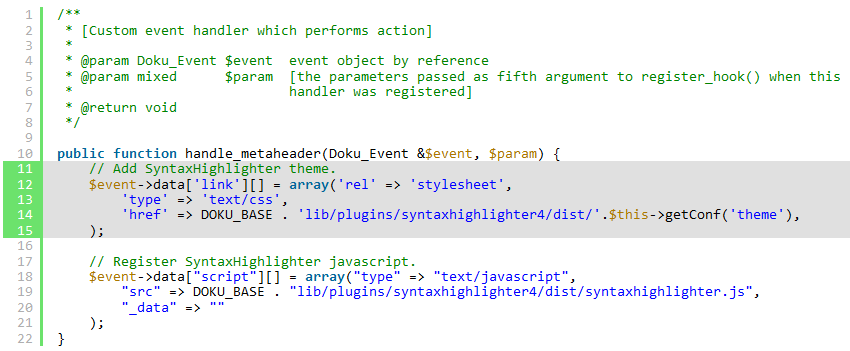

<p align="center"><a href="https://github.com/crazy-max/dokuwiki-plugin-syntaxhighlighter4" target="_blank"></a></p>

<p align="center">
  <a href="https://github.com/crazy-max/dokuwiki-plugin-syntaxhighlighter4/releases"></a>
  <a href="https://www.dokuwiki.org/releasenames"></a>
  <a href="https://www.codacy.com/app/crazy-max/dokuwiki-plugin-syntaxhighlighter4"></a>
  <br /><a href="https://github.com/sponsors/crazy-max"></a>
  <a href="https://www.paypal.me/crazyws"></a>
</p>

## About

This plugin is an alternative to GeSHi server-side code highlighting of DokuWiki with client-side [SyntaxHighlighter](https://github.com/syntaxhighlighter/syntaxhighlighter) by Alex Gorbatchev.<br />

The subfolder `syntaxhighlighter4/dist` contains a build of [SyntaxHighlighter 4.x](https://github.com/syntaxhighlighter/syntaxhighlighter).<br />

For compatibility and conflicts with others plugins, please refer to the official [DokuWiki SyntaxHighlighter4 plugin page](http://www.dokuwiki.org/plugin:syntaxhighlighter4).

## Download and Installation

Download and install the plugin using the [Plugin Manager](https://www.dokuwiki.org/plugin:plugin) using the download link given above. Refer to [Plugins](https://www.dokuwiki.org/plugins) on how to install plugins manually.<br />

If you install this plugin manually, make sure it is installed in `lib/plugins/syntaxhighlighter4/`. If the folder is called different it will not work!

## Syntax and Usage

```
<sxh [brush][; options]>
... code/text ...
</sxh>
```

### Brush

The brush (language) that SyntaxHighlighter should use. Defaults to "text" if none is provided.<br />
See the section [brushes and themes](#list-of-brushes-and-themes) for a complete list of available brushes.

### Options

Semicolon separated options for SyntaxHighlighter, see [SyntaxHighlighter Configuration](https://github.com/syntaxhighlighter/syntaxhighlighter/wiki/Configuration#per-element-configuration).<br />
The plugin handles the [Block Title from SyntaxHighlighter 3](http://alexgorbatchev.com/SyntaxHighlighter/whatsnew.html#blocktitle) as an option, i.e. `title: <title string>;`.

### Defaults

[Syntaxhighlighter default options](https://github.com/syntaxhighlighter/syntaxhighlighter/wiki/Configuration#options) can be overrided via the [Config Manager](https://www.dokuwiki.org/plugin:config) :
* **autoLinks**: Allows you to turn detection of links in the highlighted element on and off. If the option is turned off, URLs won’t be clickable `(default true)`
* **firstLine**: Allows you to change the first (starting) line number `(default 1)`
* **gutter**: Allows you to turn gutter with line numbers `(default true)`
* **htmlScript**: Allows you to highlight a mixture of HTML/XML code and a script which is very common in web development. Setting this value to true requires that you have shBrushXml.js loaded and that the brush you are using supports this feature `(default false)`
* **smartTabs**: Allows you to turn smart tabs feature on and off `(default true)`
* **tabSize**: Allows you to adjust tab size `(default 4)`
* **override**: List of tags to override

## Example

```
<sxh php; first-line: 89; highlight: [106,107]; title: New title attribute in action>
    /**
     * Render xhtml output or metadata
     *
     * @param string         $mode      Renderer mode (supported modes: xhtml)
     * @param Doku_Renderer  $renderer  The renderer
     * @param array          $data      The data from the handler() function
     * @return bool If rendering was successful.
     */
    public function render($mode, Doku_Renderer &$renderer, $data) {
        if($mode != 'xhtml') return false;

        if (count($data) != 3) {
            return true;
        }

        list($syntax, $attr, $content) = $data;
        if ($syntax == 'sxh') {
            $title = $this->procTitle($attr);
            $highlight = $this->procHighlight($attr);
            $renderer->doc .= '<pre class="brush: ' . strtolower($attr . $highlight) . '"' . $title . '>' . $renderer->_xmlEntities($content) . '</pre>';
        } else {
            $renderer->file($content);
        }

        return true;
    }
</sxh>
```

Expected result:


## Features

### Copy to clipboard

Double click anywhere inside SyntaxHighlighter code area to highlight the text and then copy it using Ctrl/Cmd+C or mouse right click > Copy.<br />
Click outside the code area to restore highlighting.

### Highlight a range of lines

Example:

```
<sxh php; highlight: [11-15]>
    /**
     * [Custom event handler which performs action]
     *
     * @param Doku_Event $event  event object by reference
     * @param mixed      $param  [the parameters passed as fifth argument to register_hook() when this
     *                           handler was registered]
     * @return void
     */

    public function handle_metaheader(Doku_Event &$event, $param) {
        // Add SyntaxHighlighter theme.
        $event->data['link'][] = array('rel' => 'stylesheet',
            'type' => 'text/css',
            'href' => DOKU_BASE . 'lib/plugins/syntaxhighlighter4/dist/'.$this->getConf('theme'),
        );

        // Register SyntaxHighlighter javascript.
        $event->data["script"][] = array("type" => "text/javascript",
            "src" => DOKU_BASE . "lib/plugins/syntaxhighlighter4/dist/syntaxhighlighter.js",
            "_data" => ""
        );
    }
</sxh>
```

Expected result:



### List of brushes and themes

* **[Official brushes](https://github.com/syntaxhighlighter/syntaxhighlighter/wiki/Brushes-and-Themes)**
  * applescript
  * as3
  * base
  * bash
  * coldfusion
  * cpp
  * csharp
  * css
  * delphi
  * diff
  * erlang
  * groovy
  * haxe
  * java
  * javafx
  * javascript
  * perl
  * php
  * plain
  * powershell
  * python
  * ruby
  * sass
  * scala
  * sql
  * swift
  * tap
  * typescript
  * vb
  * xml
* **Custom brushes**
  * halcon
  * IEC61131
  * kotlin
  * latex
  * Makefile
  * mel
  * objective-c
  * yaml
* **[Official themes](https://github.com/syntaxhighlighter/syntaxhighlighter/wiki/Brushes-and-Themes)**
  * default
  * django
  * eclipse
  * emacs
  * fadetogrey
  * mdultra
  * midnight
  * rdark
  * swift
* **Custom themes**

## How can I help ?

All kinds of contributions are welcome :raised_hands:! The most basic way to show your support is to star :star2: the project, or to raise issues :speech_balloon: You can also support this project by [**becoming a sponsor on GitHub**](https://github.com/sponsors/crazy-max) :clap: or by making a [Paypal donation](https://www.paypal.me/crazyws) to ensure this journey continues indefinitely! :rocket:

Thanks again for your support, it is much appreciated! :pray:

## License

GPLv2. See `LICENSE` for more details.<br />
Icon credit to [Snip Master](http://www.snipicons.com/).
